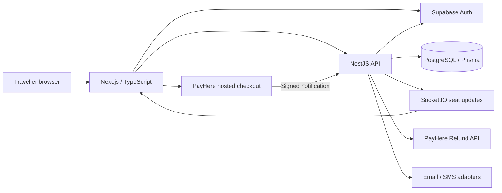

# Way To Home portfolio pack

## Project pitch

Way To Home is a full-stack bus booking application for Sri Lankan journeys. It combines route search, seat selection, journey comparison, saved route shortcuts, protected user/admin pages, QR tickets and a cancellation/refund workflow. The UI supports English, Tamil and Sinhala labels plus night mode. External authentication and payment adapters are implemented; actual provider verification and public deployment are pending.

## Architecture



## Demo video

[Watch the local booking walkthrough](demo/booking-walkthrough.webm). This silent recording uses sample passenger details, an in-memory demo schedule and a simulated payment. It demonstrates search → seat selection → booking → QR ticket. It does not demonstrate live Google/OTP/PayHere delivery.

To record it again while `npm run dev` is running:

```bash
node scripts/record-demo.mjs
```

The script creates one sample booking in the running demo and requires demo mode. It does not perform real payments. Use the following narration yourself or as a separate voiceover:

> This is Way To Home, my full-stack bus booking project. I select a route and travel date, then compare available journeys. The fare comes from the server. I choose a seat and enter sample passenger details. In this recording the payment is simulated. A confirmed booking appears in My Bookings with a QR ticket. In the production integration, a browser redirect is not enough to confirm payment: the API must verify the provider notification. A traveller can request cancellation, and the admin can review a full refund.

## Interview preparation

| Question                                    | Answer to understand and demonstrate                                                                                                                                                      |
| ------------------------------------------- | ----------------------------------------------------------------------------------------------------------------------------------------------------------------------------------------- |
| Why Next.js and NestJS?                     | Next.js provides the UI and routes; NestJS separates API validation, authentication, bookings and provider logic. Explain the deployment tradeoff of maintaining two services.            |
| How is double booking prevented?            | Each inventory writer takes a PostgreSQL transaction-scoped advisory lock for the trip; reservations also have a unique trip/seat constraint. A UI-disabled seat alone is not sufficient. |
| Can a user change the price in the browser? | The server computes the price from the trip and chosen seats. The provider callback amount/currency must match the stored booking.                                                        |
| How are roles protected?                    | The API verifies the Supabase token and compares the verified user ID to the server-side admin allowlist. Frontend route boundaries improve UX, but backend guards enforce access.        |
| What confirms a payment?                    | A verified provider notification. The return page cannot mark a booking paid. Repeated callbacks and late payments have explicit handling.                                                |
| What happens when a refund times out?       | A persisted claim prevents automatic resubmission. The booking stays REFUND_PENDING for provider reconciliation; the application does not pretend the refund succeeded.                   |
| Is realtime enough?                         | No. The database remains authoritative; Socket.IO updates and polling help refresh availability. A seat is checked again when held.                                                       |
| What would you improve next?                | Durable notification jobs, measured query optimization, shared multi-instance Socket.IO broadcasts, automated refund reconciliation and complete translation coverage.                    |

Read the corresponding implementations in `apps/api/src/booking.service.ts`, `store.ts`, `auth.ts`, and `payment.ts`. Run the tests and explain a failure scenario before presenting the project. Be candid about AI assistance and describe what you personally reviewed, tested and understood.

## CV wording

**Way To Home — Full-Stack Bus Booking Platform**

- Developed a Next.js/TypeScript frontend and NestJS API with PostgreSQL/Prisma, route comparison, seat selection and QR tickets.
- Implemented transactional seat reservation, server-verified authentication/payment adapters and a cancellation/refund workflow with automated tests.
- Designed responsive multilingual interfaces with night mode and browser-saved route shortcuts.

Add a public URL and provider-verification claim only after those steps are completed. Do not claim real passengers, revenue, performance improvements or production scale without measured evidence.
